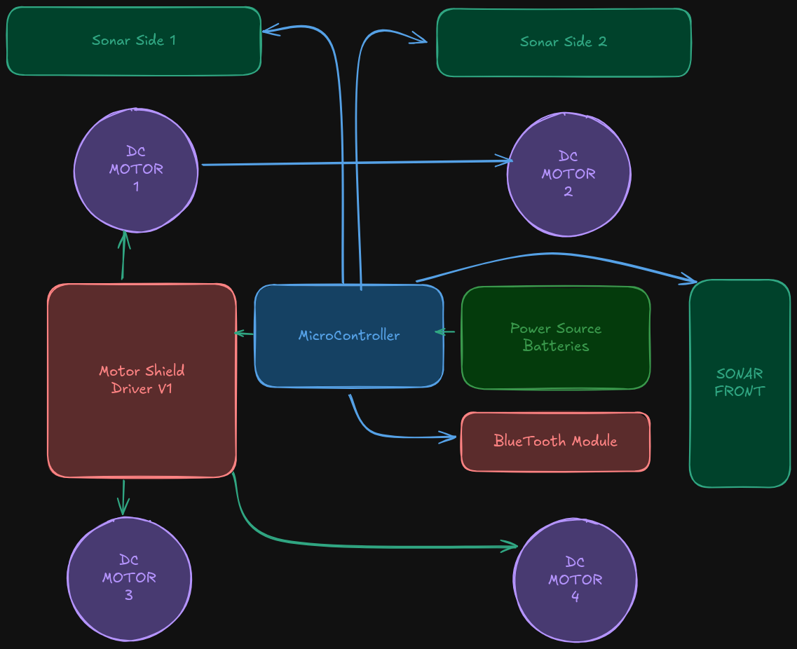

#  Self-Parking Car

   

    🏎️ Our teeny tiny car

   

 
      

##  Workings

   

##  Table of Contents

- <a href ="#features"> ✨ Overview</a>
- <a href ="#usage"> 🛠️ Implemented low level drivers</a>
- <a href ="#contributors"> ✨ Contributors</a>
- <a href ="#license"> 🔒 License</a>

##  Overview

 
<ul> 
<li> Implemented navigation and parking algorithms using low level io programming for direct ATMEGA handling.</li>
<li> Interfaced Ultrasonic sensors for distance measurement.</li>
<li> Interfaced Bluetooth module for remote control.</li>
<li> Interfaced motor driver and shield for motor control.</li>
</ul>

   

 
     

   

##  Low Level Drivers 

<ul>
<li>Bluetooth Driver interfacing UART directly</li>
<li>Ultrasonic Sensor Driver with custom pulsein implementation</li>
<li>Motor Driver with PWM control</li>
<li>low level navigation algo</li>
</ul>

##  Contributors

<table  >
  <tr>
      <td align="center"><a href="https://github.com/amir-kedis"> <b>Amir Kedis </b></a> </td>
     <td align="center"><a href="https://github.com/g-magdy"> <b>George Magdy </b></a> </td>
     <td align="center"><a href="https://github.com/Abdulrahman-Mostafa10"> <b>Abdulrahman Mostafa</b></a> </td>
     <td align="center"><a href="https://github.com/AbdelruhmanSamy"> <b>Abdelruhman Samy </b></a> </td>
     <td align="center"><a href="https://github.com/akramhany"> <b>Akram Hany </b></a> </td>

  </tr>
</table>

## 🔒 License 

> This software is licensed under the MIT License. See [License](LICENSE) for more information. © Amir.